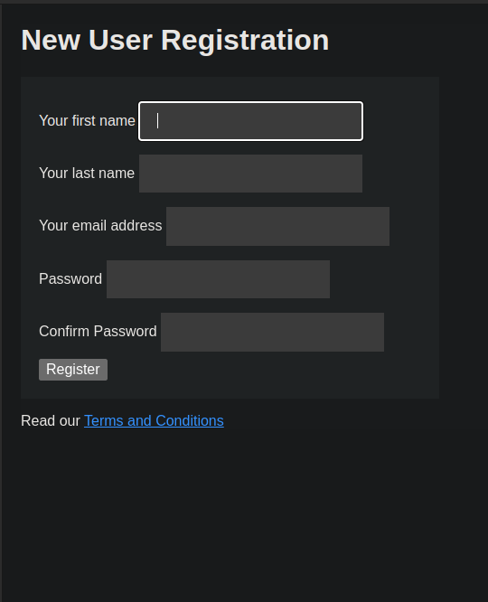

# Webdev Exercise
Webdev exercise consolidates concepts during the first semester of the second year. These sections/exercises(rephrase) showcase our understanding of HTTP APIs, Relational database design and SQL, Object Persistence, HTML and CSS.

## Requirements
This project uses Java version 17.

## Installation

Use the git clone <git@gitlab.wethinkco.de:mmoss021/suzanne-jackson-seta-web-exercise-for-presentation.git> to install Webdev exercise project using the SSH clone command from the terminal.

Use the git clone <https://gitlab.wethinkco.de/mmoss021/suzanne-jackson-seta-web-exercise-for-presentation.git> to install Webdev exercise project using the HTTPS clone command from the terminal.

Use the project link to download the zip file to your computer <https://gitlab.wethinkco.de/mmoss021/suzanne-jackson-seta-web-exercise-for-presentation>

```bash using SSH clone
git clone git@gitlab.wethinkco.de:mmoss021/suzanne-jackson-seta-web-exercise-for-presentation.git
```

```bash using HTTPS clone
git clone https://gitlab.wethinkco.de/mmoss021/suzanne-jackson-seta-web-exercise-for-presentation.git
```

## To Run Program

Use the terminal and navigate to the project directory.

```# clean: @ Clean the build
mvn clean
```

```# test: @ Run all tests
mvn test
```

```# run Server: WebServer
mvn package
mvn compile exec:java -Dexec.mainClass="wethinkcode.web.WebServer"
or 
make run
```

## Screenshots

mvn clean


mvn test




## Authors to Acknowledge
Kagiso Moepya
Morgan Moss
Martin Lekhatla
Chelsea Rutgers
